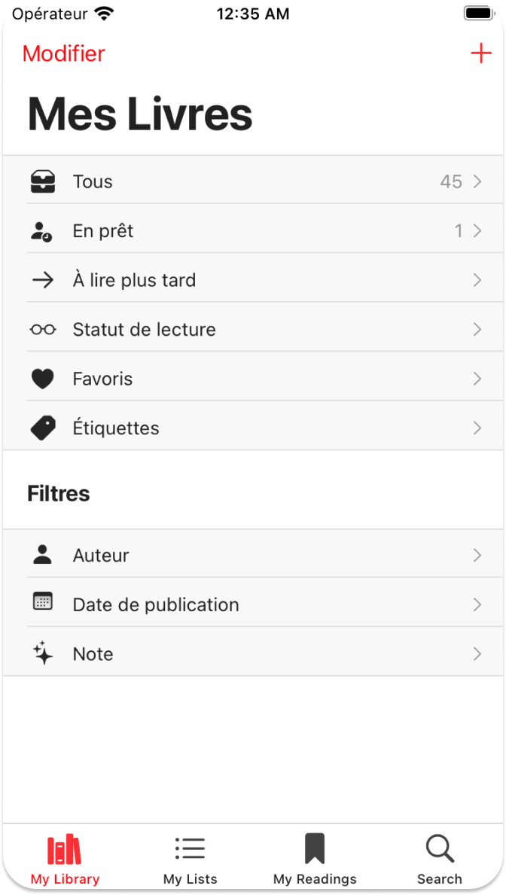
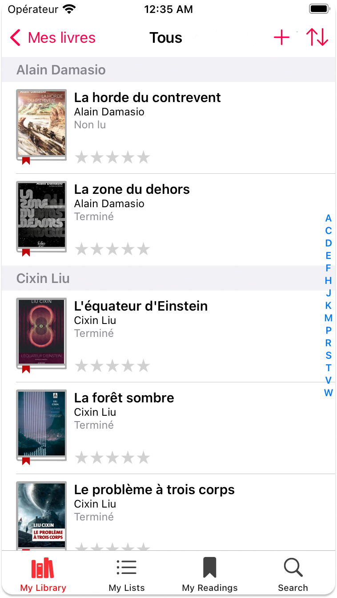
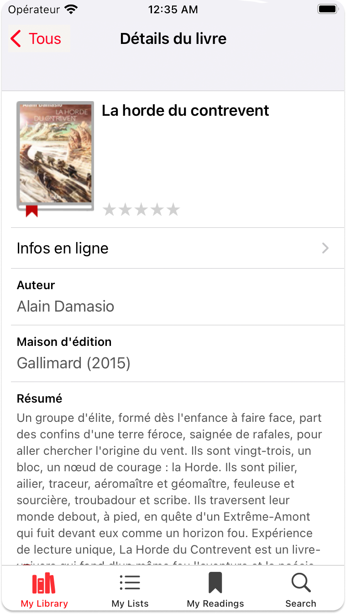
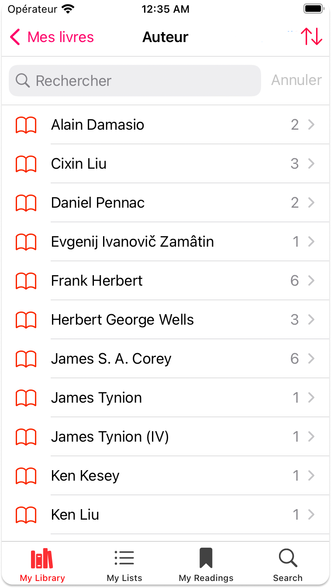

<div align = center>

  
    
---

&nbsp; 
&nbsp; 
&nbsp; 
&nbsp; 
&nbsp; 

### La lecture en un seul clic ! :closed_book:

Projet de 3ème année axé sur le domaine des livres :bookmark:, dont l'objectif est de développer une application mobile multiplateforme :iphone: en utilisant le framework MAUI tout en appliquant le patron d'architecture MVVM.

Cette application exploite les fonctionnalités d'Open Library et propose également un mode sombre :new_moon:.

# Répartition du gitlab

[**Sources**](Sources) : **Code de l'application**

[**Documentation**](Documentation) : **Documentation de l'application**

👉 [**Solution de l'application**](Sources/PocketBook.sln)

# Fonctionnalités

### OS le mieux adaptés : IOS

:information_source: *Quelques petites erreurs d'affichage ont lieu sur Android. Testez-le sur iOS pour une expérience optimisée !*

```Où en suis-je``` :grey_question::grey_exclamation: (:white_check_mark: réalisé, :warning: presque abouti, :x: non commencé )

### Côté Vues :

:white_check_mark: [**Partie 1**](Sources/PocketBook/MainPage.xaml) : **Réalisation de la page Bibliothèque**

:white_check_mark: [**Partie 2**](Sources/PocketBook/Pages/BooksPage.xaml) : **Réalisation de la page affichant les livres**

:white_check_mark: [**Partie 3**](Sources/PocketBook/Pages/BookPage.xaml) : **Réalisation de la page affichant les détails d'un livre**

:white_check_mark: [**Partie 4**](Sources/PocketBook/Views/MenuView.xaml) : **Réalisation du menu contextuel permettant d'ajouter un nouveau livre**

:white_check_mark: [**Partie 5**](Sources/PocketBook/Pages/LoanPage.xaml) : **Réalisation de la page permettant de prêter ou d'emprunter à livre à quelqu'un**

:white_check_mark: [**Partie 6**](Sources/PocketBook/Pages/FilteringPage.xaml) : **Réalisation de la page permettant de lister les années de publication et de filtrer les livres**

:white_check_mark: [**Partie 7**](Sources/PocketBook/Pages/FilteringPage.xaml) : **Réalisation de la page permettant de trier les livres par note**

:white_check_mark: [**Partie 8**](Sources/PocketBook/Pages/FilteringPage.xaml) : **Réalisation de la page permettant de lister les auteurs et de filtrer les livres par auteur**

:x: [**Partie 8**](Sources/PocketBook/Pages/FilteringPage.xaml) : **Réalisation de la page Scan**

### Côté Model :

:x: [**Partie 1**]() : **Changer le statut de lecture d'un livre**

:warning: [**Partie 2**](Sources/ViewModel/ManagerVM.cs) : **Ajouter un livre aux favoris**

:white_check_mark: [**Partie 3**](Sources/ViewModel/ManagerVM.cs) : **Filtrer les livres par Auteur, Date de publication, Note**

:white_check_mark: [**Partie 4**](Sources/PocketBook/ViewModels/ScanMenuVM.cs) : **Ajouter un livre à sa collection en saisissant l'ISBN**

:warning: [**Partie 5**](Sources/ViewModel/ManagerVM.cs) : **Supprimer un livre**

:x: [**Partie 6**]() : **Prêter un livre**

:warning: [**Partie 7**](Sources/ViewModel/ManagerVM.cs) : **Pagination**

:white_check_mark: [**Partie 8**](Sources/PocketBook/ViewModels/NavigationVM.cs) : **Navigation**

### Autres :

:white_check_mark: [**Partie 1**](Sources/PocketBook/Resources/Styles/MyStyles.xaml) : **DarkMode**

:x: [**Partie 2**]() : **MVVM Community Toolkit**


# Vues






# Architecture de l'application


# Technicien 

<a href = "https://codefirst.iut.uca.fr/git/emre.kartal">

</br>
Emre.kartal@etu.uca.fr
</br>
</a>
© PM1

</div>

<div align = right>
<a rel="license" href="http://creativecommons.org/licenses/by-nc-nd/4.0/"></a>
<right>