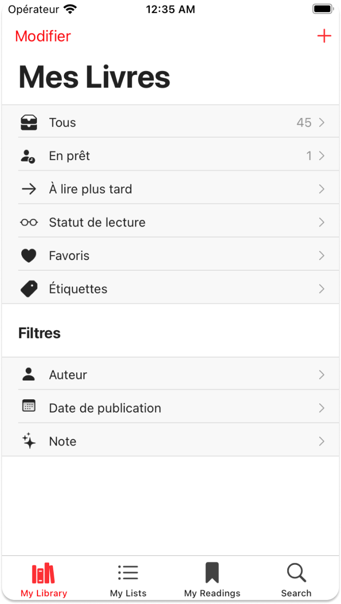

  
    
---

&nbsp; 
&nbsp; 
&nbsp; 
&nbsp; 
&nbsp; 

### La lecture en un seul clic ! :closed_book:

Projet de 3ème année axé sur le domaine des livres :bookmark:, dont l'objectif est de développer une application mobile multiplateforme :iphone: en utilisant le framework MAUI tout en appliquant le patron d'architecture MVVM.

Cette application exploite les fonctionnalités d'Open Library et propose également un mode sombre :new_moon:.

# Répartition du gitlab

[**Sources**](Sources) : **Code de l'application**

[**Documentation**](Documentation) : **Documentation de l'application**

👉 [**Solution de l'application**](Sources/PocketBook.sln)

# Vues

# Technicien 

<a href = "https://codefirst.iut.uca.fr/git/emre.kartal">

 
Emre.kartal@etu.uca.fr
 
</a>
© PM1

<right>